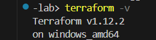
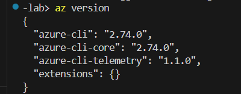
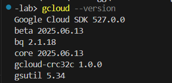
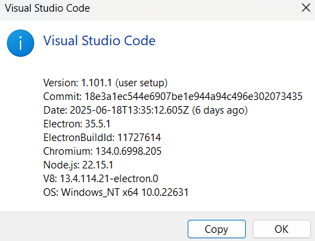
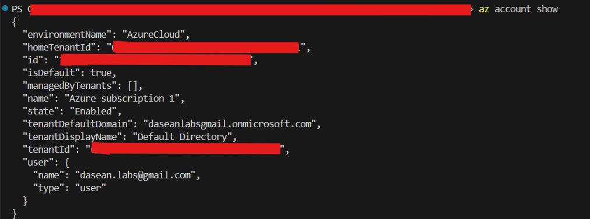
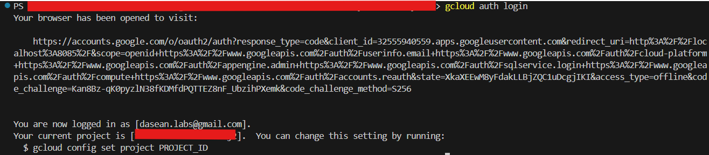

# Phase 1: Environment Setup & Lab Preparation

This phase focuses on preparing the full development and security environment to support hands-on cloud cybersecurity projects. The goal was to ensure all necessary tools, accounts, and structure were in place for a smooth start to the lab journey.

## ✅ Tools Installed & Verified

|   Tools                           | Purpose                               | Version Verification
|-----------------------------------|---------------------------------------|-----------------------------------
|   Terraform CLI                   |   Infrastructure as Code              |  
|   Azure CLI                       |   Manage Azure resources              |  
|   GCP CLI (gcloud)                |   Manage GCP resources                |  
|   Git                             |   Source control + GitHub integration |  
|   Visual Studio Code              |   Code editing and project structure  |  
|   NordPass                        |   Secrets & credentials management    |  

## ☁️ Cloud Account Setup
| Task                                                          | Status   | Screenshot
|---------------------------------------------------------------|----------|-----------------------------------------------------
| Azure account created and CLI authenticated                   |   ✅    | 
| GCP account created and gcloud initialized                    |   ✅    | 
| NordPass configured to store cloud secrets securely           |   ✅    | *(Not applicable / Skipped for security)*