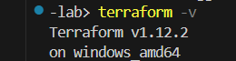
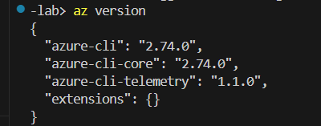
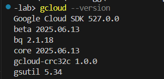

# Phase 1: Environment Setup & Lab Preparation

This week focused on preparing the full development and security environment to support hands-on cloud cybersecurity projects. The goal was to ensure all necessary tools, accounts, and structure were in place for a smooth start to the lab journey.

## ✅ Tools Installed & Verified

|   Tools                           | Purpose                               | Version Verified
|-----------------------------------|---------------------------------------|-----------------------------------
|   Terraform CLI                   |   Infrastructure as Code              |  
|   Azure CLI                       |   Manage Azure resources              |  
|   GCP CLI (gcloud)                |   Manage GCP resources                |  
|   Git                             |   Source control + GitHub integration |  
|   Visual Studio Code              |   Code editing and project structure  |   v1.101.1
|   NordPass                        |   Secrets & credentials management    |  


## 💾 Version Output (Sample)
```bash
$ terraform -v
Terraform v1.12.2

$ az version
}
    "azure-cli": "2.74.0",
    ...
}

$ gcloud --version
Google Cloud SDK 527.0.0
...

$ git --version
git version 2.50.0.windows.1
```

